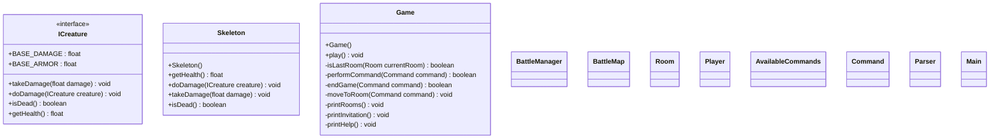

# WoF_BattleEdition
 
# UML - Class

```mermaid
classDiagram
      class ICreature{
        +BASE_DAMAGE : float
        +BASE_ARMOR : float
        <<interface>>
        +takeDamage(float damage) void
        +doDamage(ICreature creature) void
        +isDead() boolean
        +getHealth() float
      }
      class Skeleton{
        +Skeleton() 
        +getHealth() float
        +doDamage(ICreature creature) void
        +takeDamage(float damage) void
        +isDead() boolean
      }
      class Game {
        +Game()
        +play() void
        -isLastRoom(Room currentRoom) boolean
        -performCommand(Command command) boolean
        -endGame(Command command) boolean
        -moveToRoom(Command command) void
        -printRooms() void
        -printInvitation() void
        -printHelp() void
      }
      class BattleManager{

      }
      class BattleMap{

      }
      class Room{

      }
      class Player{

      }
      class AvailableCommands{

      }
      class Command{

      }
      class Parser{

      }
      class Main{

      }
```
